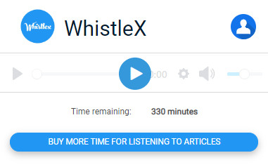
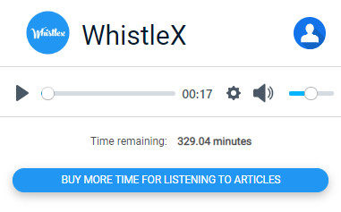
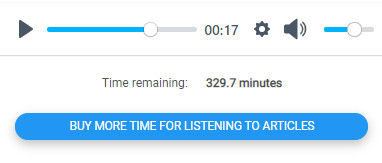

# WhistleX

WhistleX is a Google Chrome extension that reads articles to you. You go to any blog or news website, select your desired article, click on the extension icon, press play and the extension will convert the article to audio format, and read it to you. You can skip, pause, speed up, or slow down the reading speed. You can also change the voice of the reader.

## Table of contents

- [Overview](#overview)
  - [The challenge](#the-challenge)
  - [Screenshot](#screenshot)
  - [Links](#links)
  - [Built with](#built-with)
  - [What I learned](#what-i-learned)
  - [Continued development](#continued-development)
- [Author](#author)

## Overview

### The challenge

There were many challenges that I needed to overcome to complete this project. Here are the ones that gave me the most trouble:

- User authentication
- Storing users in the Firebase database
- Tracking how many words the user has converted to audio
- Converting the article to audio
- Identifying only the actual article text that needs to be converted to audio
- Creating a website for the showcase of the extension
- Connecting the website to the Firebase database
- Using the Google Cloud Platform

### Screenshot

### Links

The extension is available on Google web store

- Add WhistleX to Chrome - [https://chrome.google.com/webstore/detail/whistlex](https://chrome.google.com/webstore/detail/whistlex/dokgcndnejoflhcenndddmdfkficjgbm)

Since me and my friend Ilija were participating in a startup competition with this project, as a part of the prize, with got our dedicated article in the news which you can check out here:

- Read about me in the news - [www.jutarnji.hr/vijesti/whistlex](https://www.jutarnji.hr/vijesti/hrvatska/video-dvojica-srednjoskolaca-rade-na-revolucionarnoj-ideji-njihova-aplikacija-pretvara-tekst-u-govor-evo-kako-smo-dosli-do-ove-ideje-10069153)

### Built with

- Semantic HTML5 markup
- CSS custom properties
- Flexbox
- CSS Grid
- Python
- JavaScript
- Firebase
- Google Chrome API
- Google Text-to-Speech API
- Google Cloud Platform
- Google Cloud Functions
- Figma

### What I learned

I learned a ton while doing this project. This was one of my first full-stack web projects. I had to learn how to make a Google Chrome extension, how to use the Google Cloud Platform, then how to connect these two and create something useful. I also needed to learn so much about how to design the UI, how to make it appealing to users, and how to use design tools like Figma.

Sending text data from the extension to Google Cloud Functions, then converting that text to audio, and then sending that audio back to the extension was a very complex process, which required splitting audio into chunks, sending them to the extension, and then putting them back together, while making sure that the audio at the end doesn't have any glitches or skips. This is the part that really taught me a lot about how data transfer works.

### Continued development

Since, me and my friend Ilija, who I worked on this project with, no longer live nearby, and because of University and other projects, this project is on standby. Not because I don't believe in it, but because further development would require a lot of time, and probably a whole team of people, which costs money. That's why I decided that I will not be actively working on this project until further notice.

## Authors

Jure Reljanović

- LinkedIn - [Jure Reljanović](https://www.linkedin.com/in/jure-reljanovi%C4%87-57b6291a8/)
- Website - (in the process)

Ilija Mihajlović

- LinkedIn - [Ilija Mihajlović](https://www.linkedin.com/in/ilija-mihajlovic-18942b253/)
- Website - [ilija-mihaljovic.com](https://ilija-mihajlovic.netlify.app/)
